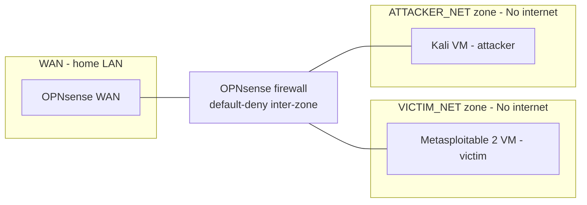

# homelab-IDS_Practice

This is a segemented IDS detection lab built on a single Proxmox host. A Kali Linux virtual machine (VM) sends attack traffic from its network segment, to a separate one containing a Metasploitable 2 
VM, the victim device. While in transit, this traffic is routed through an Opnsense VM, that connects the two subnets and also employs an intrusion detection system (IDS), to search for indicators 
of malicious activity. 

**Content:** Architecture, design choices and considerations, and the undertaken exercises for this project are outlined in the rest of the repository.

**Goal:** With this being my first cyber focused project and my first time using the Proxmox platform, this project had a triple focus of familiarising myself with Proxmox (i.e. understanding VM creation and 
maintenance, routing, the firewall and IDS service), accustomising myself with IDS rules and alerts and improving my network traffic analysis skills. 

## Architecture Overview

Three zones on one hypervisor, all inter-zone traffic routed and filtered by a dedicated OPNsense VM:
