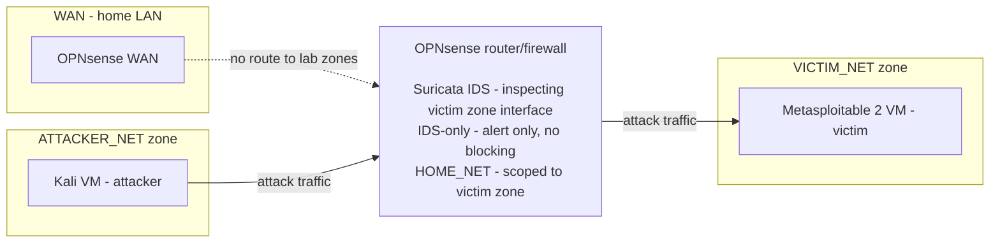

# homelab-IDS

This is a segmented intrusion detection system (IDS) lab, built on a single Proxmox host. A Kali Linux virtual machine (VM) sends attack traffic from its network segment to a separate one containing a Metasploitable 2 VM, the victim device. All traffic between the two segments transits an OPNsense VM, which routes between the subnets and runs Suricata to inspect it for indicators of malicious activity.

**Goal:** This lab tests whether a signature-based IDS detects a realistic recon-to-exploit chain when the attacker is internal, and to document where it fails. 

## Architecture Overview



Three zones on one hypervisor, all inter-zone traffic routed by the dedicated OPNsense VM:
- **VICTIM_NET** — The zone that attack traffic is directed to. Hosts the Victim (Metasploitable 2).
- **ATTACKER_NET** — The zone that contains the Attacker (Kali).
- **WAN** — uplink to the home LAN.

All traffic is permitted between the attacker and victim zones, so that the sensor observes the complete attack chain without the firewall dropping traffic and confounding the results. Both of these zones are denied access to the WAN and WAN traffic destined for them is also denied by default, ensuring that the attacker and victim zones have no access to the internet. Full topology, addressing, data flows, trust boundaries, and threat model are documented in docs/Architecture.md.

## Key Findings
- A correctly enabled ET signatures for the Nmap -sV SYN sweep, vsftpd 2.3.4 backdoor and post-exploitation activity silently failed to fire because HOME_NET defaulted to all RFC1918 space, placing the attacker inside the trusted network. Diagnosed by observing that every firing rule had a HOME_NET source address.
- Nmap scan findings (needs completion)
- Exploitation and post exploitation findings (needs completion)

## Stack
 
| Component | Role |
|---|---|
| Proxmox VE | Hypervisor |
| OPNsense | Firewall / router / IDS between zones |
| Suricata + ET Open rules with Hyperscan | Detection |
| Kali Linux | Attacker platform |
| Nmap and Metasploit | Specific attacker tooling |
| Wireshark | Traffic analysis |
| Metasploitable 2 | Victim platform |

## Limitations
- **Permissive inter-zone rule** - this setup doesn't model a real perimeter.
- **IDS-only** - nothing is ever blocked and no prevention is demonstrated.
- **No IDS encrypted traffic support** - the IDS has no coverage of the payloads in encrypted traffic.
- **Single physical NIC** - zone segmentation is software-only (Linux bridges). A hypervisor compromise collapses every boundary.
- **Proxmox web UI on the WAN bridge** - reachable by anyone.


## Repository Layout
```
homelab-IDS_Practice/
├── README.md
└── docs/
    ├── architecture.md
    └── exercises.md
```
 
All activity described here was performed against virtual machines I own, on isolated lab segments with no route to the internet.
