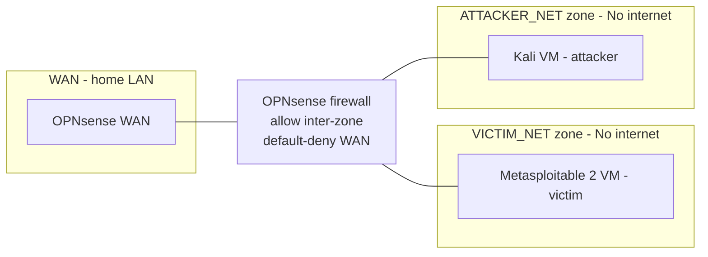

# homelab-IDS_Practice

This is a segemented IDS detection lab built on a single Proxmox host. A Kali Linux virtual machine (VM) sends attack traffic from its network segment, to a separate one containing a Metasploitable 2 
VM, the victim device. While in transit, this traffic is routed through an Opnsense VM, that connects the two subnets and also employs an intrusion detection system (IDS), to search for indicators 
of malicious activity. 

**Content:** Architecture, design choices and considerations, and the undertaken exercises are outlined in the rest of the repository.

**Goal:** This lab tests whether a signature-based IDS detects a realistic recon-to-exploit chain when the attacker is internal, and to document where it fails. 

<!--- With this being my first cyber focused project and my first time using the Proxmox platform, this had a triple focus of familiarising myself with Proxmox (i.e. understanding VM creation and 
maintenance, routing, the firewall and IDS service), accustomising myself with IDS rules and alerts and improving my network traffic analysis skills. --->

## Architecture Overview



Three zones on one hypervisor, all inter-zone traffic routed by the dedicated OPNsense VM:
- **VICTIM_NET** — The zone that attack traffic is directed to. Hosts the Victim (Metasploitable 2).
- **ATTACKER_NET** — The zone that contains the Attacker (Kali).
- **WAN** — uplink to the home LAN.

All traffic is permitted between the attacker and victim zones. Both of these zones are denied access to the WAN and WAN traffic destined for Opnsense's local area network (LAN) is also denied, ensuring that the attacker and victim zones have no access to the internet. Full topology, addressing, data flows, trust boundaries, and threat model are documented in docs/Architecture.md.

## Key Findings
- A correctly enabled ET signatures for the Nmap -sV SYN sweep, vsftpd 2.3.4 backdoor and post-exploitation activity silently failed to fire because HOME_NET defaulted to all RFC1918 space, placing the attacker inside the trusted network. Diagnosed by observing that every firing rule had a HOME_NET source address.
- Nmap scan findings (needs completion)
- Exploitation and post exploitation findings (needs completion)

## Stack
 
| Component | Role |
|---|---|
| Proxmox VE | Hypervisor |
| OPNsense | Firewall / router / IDS between zones |
| Suricata + ET Open rules with Hyperscan | Detection |
| Kali Linux | Attacker platform |
| Nmap and Metasploit | Specific attacker tooling |
| Wireshark | Traffic analysis |
| Metasploitable 2 | Victim platform |

## Limitations
- **Single physical NIC** — zone segmentation is software-only (Linux bridges). A hypervisor compromise collapses every boundary.
- **Proxmox web UI on the WAN bridge** — reachable for everyone on the home LAN.


## Repository Layout
```
homelab-IDS_Practice/
├── README.md
└── docs/
    ├── architecture.md
    └── exercises.md
```
 
## Disclaimer
 
Attacks conducted in this project target machines I own, on an isolated network with no internet route.
