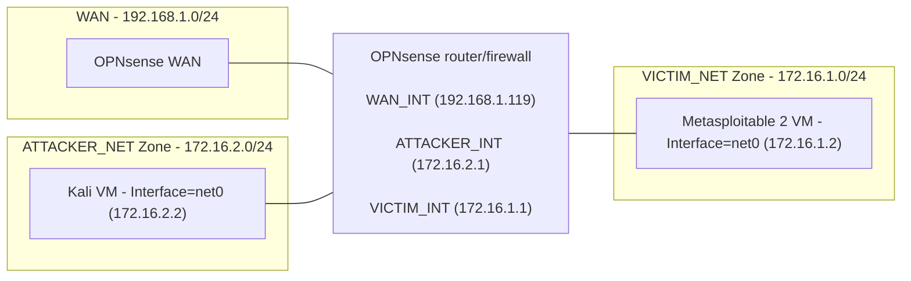

# Architecture

## Physical and virtual platform

**Host Hardware:**

The device that hosts the Proxmox VE is a HP EliteDesk 800 G3 Mini. The hardware specifications are:
- 16 GB RAM
- i5-7500 4-core
- Single Network Interface Card (NIC)
- 256GB total device storage

This platform is more than capable at supporting the three VMs it hosts, because of the amount of RAM, the four cores and the sizeable storage.

 

**Hypervisor Choice:** Proxmox VE was primarily chosen because it runs well on cheap hardware (i.e. it would run well on the mini pc) and it is a type 1 hypervisor that is free and open source, perfect for a home-lab. The native support for Linux bridges and containers was also a bonus.

 

**Logical Volume Manager (LVM) Choice:** LVM-thin was chosen as it is the Proxmox default logical volume manager for a single disk. The thin provisioning and snapshot support met the lab's needs, so there was no change needed.

 

**RAM Allocation:**
- **OPNsense** - It has 4GB of memory, which is the "reasonable" size recommended by [OPNsense]([url](https://docs.opnsense.org/manual/hardware.html)) to run all standard features.
- **Kali** - It has 4GB of memory, which is 2GB above [Kali's]([url](https://www.kali.org/docs/installation/hard-disk-install/)) minimum RAM requirements for a default Xfce4 desktop and kali-linux-default meta-package install. The extra 2GB of memory ensures that the VM runs smoothly.
- **Metasploitable 2** - It has 512MB of memory, which is the recommend RAM by [OffSec]([url](https://www.offsec.com/metasploit-unleashed/requirements/)).

 

**Single NIC Limitations:** Since the single physical NIC is enslaved to vmbr0, it is the only bridge with a path to the WAN. Vmbr1 and vmbr2 have no physical NICs and are purely in-kernal software switches. Hence, segmentation is only enforced by the hypervisor kernel.

## Network Topology ##
| Bridge | Zone | Subnet | Gateway |
|---|---|---|---|
| vmbr0 | WAN | 192.168.1.0/24 | 192.168.1.1 |
| vmbr1 | ATTACKER_NET | 172.16.2.0/24 | 172.16.2.1 |
| vmbr2 | VICTIM_NET | 172.16.1.0/24 | 172.16.1.1 |

 

**OPNsense Interface Names:**
- WAN_INT (vtnet0) --> WAN
- ATTACKER_INT (vtnet1) --> OPT1
- VICTIM_INT (vtnet2) --> LAN

**Addressing Scheme Reasoning:** To differentiate from the WAN network address (i.e. have separate addressing from my home LAN), 172.16.0.0/12 local address range was chosen. VICTIM_NET and ATTACKER_NET both have a 255.255.255.0 subnet mask because of the byte boundary simplicity.

## Zone and trust model ##

**Zone definitions and assumptions:**

- *ATTACKER_NET* — It is hostile by design. Kali is treated as fully attacker-controlled; no traffic originating here is trusted (i.e. all traffic is assumed as malicious).
- *VICTIM_NET* — It is assumed compromised. Metasploitable 2 is intentionally vulnerable and is expected to be exploited during exercises.
- *WAN* — It is out of the lab's scope, but it is trusted relative to the ATTACKER_NET and VICTIM_NET. The concern runs in both directions: the home LAN must not reach the lab (nothing here is hardened), and the lab must not reach the home LAN or the internet (both machines are hostile or compromised).
- *Hypervisor* — It is trusted and is the root of the lab's trust model. Proxmox is not defended against, monitored, or treated as an attack surface within the scope.

 

**Trust boundaries and enforcement:** The boundaries are ATTACKER_NET ↔ VICTIM_NET and lab ↔ WAN. Both are enforced solely by firewall rules on the OPNsense VM. Since vmbr1 (ATTACKER_NET Linux bridge) and vmbr2 (VICTIM_NET Linux bridge) have no physical NIC, there is no enforcement below the hypervisor kernel and thus the boundaries are software constructs, not physical separation.

 

**Known weakness:** 
- The Proxmox web UI is reachable from the home LAN. The management interface of the hypervisor is bound to vmbr0 (WAN Linux bridge), so any host on the home LAN can reach it. This exposes the trust root of the entire lab to the least-controlled network in the design. It is accepted because no management zone exists in this build. Hence, remediation would be a dedicated management interface, something for the future.
- The OPNsense web GUI is reachable from ATTACKER_NET. Kali has access to the management interface of the device that both enforces every trust boundary and hosts the IDS sensor. Hence, a compromise of the attacker would defeat segmentation and detection. This is accepted because Kali is the only machine in the lab with a desktop and browser, and it is a single controlled VM. Remediation would be a dedicated management interface.

## Firewall Policy ##

OPNsense uses pf (Packet Filter), the native stateful packet filtering engine from the FreeBSD operating system. The table below contains the configured firewall rules that are relevant to the project. 

| Interface | Source | Destination | Port | Action | Rationale |
|---|---|---|---|---|---|
| ATTACKER_INT | ATTACKER_NET | VICTIM_NET | Any | Pass | To allow all attack traffic to pass to VICTIM_NET. |
| ATTACKER_INT | 172.16.2.2 | 172.16.2.1 | 443 | Pass | To allow the attacker to access the OPNsense's web GUI. This is a weakness but it is for convenience over correctness. |
| VICTIM_INT | VICTIM_NET | ATTACKER_NET | Any | Pass | To allow victim traffic to pass to ATTACKER_NET. |

 

The inter-zone firewall rules, in rows one and three, were deliberately configured to allow all attacker-to-victim traffic across the OPNsense boundary, so that it would traverse the IDS sensor. Because pf is stateful, each pass rule creates a state entry when a connection is initiated, so return traffic is permitted automatically and no rules are required in the reverse direction. The rule in the first row allows the attacker to initiate communication with the victim machine, for reconnaissance and exploitation. The rule in the third row permits the outbound connection the reverse shell payload opens from the victim back to the attacker's listener. This is the deliberate inverse of a segmentation control and would be unacceptable in a production network. It is accepted here so the sensor observes the complete attack chain. 

pf's implicit default block per-interface inbound denies access to WAN because no rule on ATTACKER_INT or VICTIM_INT permits a WAN destination. WAN_INT has no rules at all, so nothing from the home LAN can enter the lab. This is deliberate because the project does not need the attacker or victim to communicate with the outside. 

## IDS design ##

