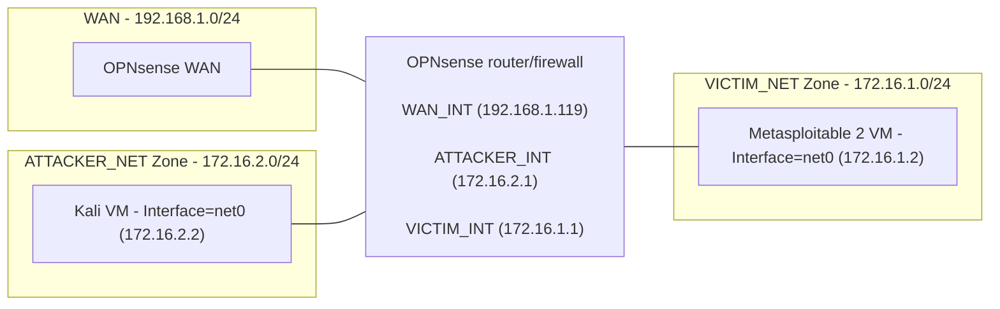

# Architecture

## Physical and virtual platform

**Host Hardware:**

The device that hosts the Proxmox VE is a HP EliteDesk 800 G3 Mini. The hardware specifications are:
- 16 GB RAM
- i5-7500 4-core
- single Network Interface Card (NIC)
- 256GB total device storage

This platform is more than capable at supporting the three VMs it hosts, because of the amount of RAM, the four cores and the sizeable storage.

 

**Hypervisor Choice:** Proxmox VE was primarily chosen because it runs well on cheap hardware (i.e. it would run well on the mini pc) and it is a type 1 hypervisor that is free and open source, perfect for a home-lab. The native support for Linux bridges and containers was also a bonus.

 

**Logical Volume Manager (LVM) Choice:** LVM-thin was chosen as it is the Proxmox default logical volume manager for a single disk. The thin provisioning and snapshot support met the lab's needs, so there was no change needed.

 

**RAM Allocation:**
- **OPNsense** - it has 4GB of memory, which is the reasonable size that is recommended by [OPNsense]([url](https://docs.opnsense.org/manual/hardware.html)) to run all standard features.
- **Kali** - it has 4GB of memory, which is 2GB above [Kali's]([url](https://www.kali.org/docs/installation/hard-disk-install/)) minimum RAM requirements for a default Xfce4 desktop and kali-linux-default meta-package install. The extra 2GB of memory ensures that the VM runs smoothly.
- **Metasploitable 2** - it has 512MB of memory, which is the recommend RAM by [OffSec]([url](https://www.offsec.com/metasploit-unleashed/requirements/)).

 

**Single NIC Limitations:** Since the single physical NIC is enslaved to vmbr0, it is the only bridge with a path to the WAN. Vmbr1 and vmbr2 have no physical NICs and are purely in-kernal software switches. Hence, segmentation is only enforced by the hypervisor kernel.

## Network Topology ##
| Bridge | Zone | Subnet | Gateway |
|---|---|---|---|
| vmbr0 | WAN | 192.168.1.0/24 | 192.168.1.1 |
| vmbr1 | ATTACKER_NET | 172.16.2.0/24 | 172.16.2.1 |
| vmbr2 | VICTIM_NET | 172.16.1.0/24 | 172.16.1.1 |

 

**OPNsense Interface Names:**
- WAN_INT (vtnet0) --> WAN
- ATTACKER_INT (vtnet1) --> OPT1
- VICTIM_INT (vtnet2) --> LAN

**Addressing Scheme Reasoning:** To differentiate from the WAN network address, 172.16.0.0/12 local address range was chosen. VICTIM_NET and ATTACKER_NET both have a 255.255.255.0 subnet mask because of the byte boundary simplicity.

## Zone and trust model ##

## Firewall Policy ##

| Interface | Source | Destination | Port | Action | Rationale |
|---|---|---|---|---|---|
| WAN_INT | VICTIM_NET, ATTACKER_NET | Any | Any | Reject | To deny ATTACKER and VICTIM networks from WAN |
| ATTACKER_INT | ATTACKER_NET | VICTIM_NET | Any | Pass | To allow all attack traffic to pass to victim LAN |
| VICTIM_INT | VICTIM_NET | Any | Any | Pass | To allow all victim traffic to leave VICTIM_NET. This is a default rule for the interface assigned as LAN on OPNsense. |
| ATTACKER_INT | 172.16.2.2 | 172.16.2.1 | Any | Pass | To allow the attacker to communicate with the gateway and access the OPNsense GUI. |
| WAN_INT | WAN | 192.168.1.119, ATTACKER_NET, VICTIM_NET | Any | Pass | To allow all attack traffic to pass to victim LAN |
| vmbr1 | ATTACKER_NET | 172.16.2.0/24 | 172.16.2.1 |
| vmbr2 | VICTIM_NET | 172.16.1.0/24 | 172.16.1.1 |

## IDS design ##

